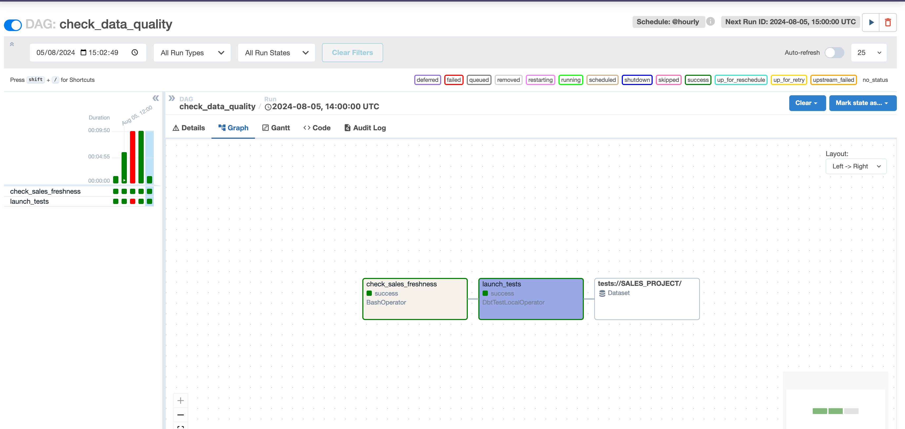

# dbt_starburst_cosmos

Il s'agit d'un mini projet de gestion de données de ventes en utilisant dbt et starburst. L'ensemble du processus est orchestré avec airflow en utilisant cosmos.

On va plus se concentrer sur la partie de transformation de la donnée avec dbt et starburst et non sur la partie d'ingestion des données.

Les scripts d'ingestion se trouvent dans le repertoire scripts.

## 1. Prérequis
- python 3.10
- Astronomer-cosmos 1.27.1
- docker 24.0.6

## 2. Utilisation
- Cloner le projet
- Dans le repertoire root du projet, créer le fichier .env en specifiant les elements necessaires
- Dans le repertoire principal du projet dbt (dbt/dbt_starburst_cosmos), ajouter le fichier profiles.yml
- Aller dans le repertoire racine du projet (~/dbt_starburst_cosmos) et lancer la commande suivante pour lancer le projet
```bash
astro dev start
```
pour arreter l'execution lancer la commande
```bash
astro dev stop
```
- Une fois le projet lancé, vous pouvez acceder à l'interface de docker pour voir les containers en cours d'execution ou avec la commande
```bash
docker ps
```
- vous pouvez visualiser les diagrammes et les dags en cours d'execution sur l'interface de airflow;  
   
Voici un exemple  



